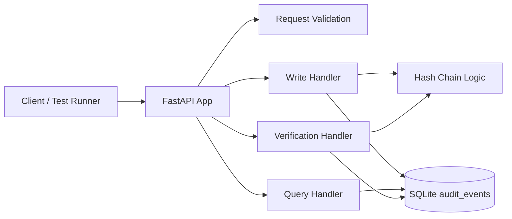

# Final Engineering Summary: Scenario A

## 1. Plan and Rationale

The objective for Scenario A was to build a working, reviewable prototype of a tamper-evident audit log service that demonstrates the core requirements of the assignment: append-only event storage, queryability, and verifiable integrity. The implementation was designed as a lightweight monolithic REST service using FastAPI and SQLite so the solution could be delivered quickly, run locally, and remain easy to explain and validate.

The plan focused on:
- interpreting the assignment into a clear implementation scope,
- building a minimal but correct API surface,
- persisting records in an append-only table,
- calculating a cryptographic hash chain for tamper evidence,
- exposing a verification endpoint,
- creating automated tests and a smoke-test report.

This approach was chosen because it prioritizes correctness, traceability, and demonstrable behavior over premature architectural complexity.

## 2. Implementation Artifacts

The repository now includes the following artifacts:

- [app.py](app.py): FastAPI application implementing the write API, query API, and verification endpoint.
- [tests/test_audit_service.py](tests/test_audit_service.py): automated tests covering success, invalid input, and tamper detection.
- [api_test_runner.py](api_test_runner.py): smoke-test script for exercising the API over HTTP.
- [api_test_report.html](api_test_report.html): generated HTML report for smoke-test execution.
- [test_report.html](test_report.html): generated HTML report for the automated pytest suite.
- [README.md](README.md): local setup and usage instructions.
- [Testing_Documentation_ScenarioA.md](Testing_Documentation_ScenarioA.md): testing approach and current coverage summary.
- [Scenario_A_Requirement_Analysis_ScenarioA.md](Scenario_A_Requirement_Analysis_ScenarioA.md): requirement interpretation and scope definition.
- [Requirements_Traceability_ScenarioA.md](Requirements_Traceability_ScenarioA.md): mapping from requirements to implemented artifacts.
- [AI_USAGE_LOG.md](AI_USAGE_LOG.md): traceability of AI-assisted work.

## 3. Design Summary

### API Surface
- POST /audit/events writes a new event.
- GET /audit/events retrieves stored events with filtering and pagination.
- GET /audit/verify walks the full chain and reports integrity status.

### Storage and Integrity Model
- Events are stored in SQLite as append-only records.
- Each record stores a previous hash and a current hash.
- The current hash is computed from the record payload and the prior chain state using SHA-256.
- Any modification to a stored event or its predecessor will cause the chain verification to fail.

### Validation Approach
- The service validates required fields at the API boundary.
- Automated tests verify the happy path and tamper-detection path.
- The smoke-test runner validates the API over HTTP and records results in HTML.

### Architecture Diagram

### High-Level Design

The solution follows a simple layered design:
1. API layer: FastAPI endpoints expose the write, query, and verify operations.
2. Domain layer: request validation and hash-chain computation enforce the service contract and integrity rules.
3. Persistence layer: SQLite stores the append-only event history and corresponding hash values.
4. Validation layer: automated tests and smoke tests exercise the service end to end and verify tamper detection.

### How Hashing Works on Records

Each record is hashed by combining the record’s content with the previous record’s hash. The implementation uses SHA-256 and computes a current hash from a canonical JSON representation of the event fields, including the event metadata and payload, plus the prior hash. The first record uses a defined genesis value, and each subsequent record links to the previous record’s hash. This creates a hash chain where any change to an earlier record invalidates the hashes that follow it, making tampering detectable.

This design keeps Scenario A easy to understand and run while still demonstrating the core engineering properties required by the assignment.

## 4. Risks, Trade-offs, and Validation

### Risks and Trade-offs
- The service uses SQLite rather than a distributed or enterprise-grade database, which keeps the prototype simple but limits scalability and concurrency.
- The current implementation supports a core prototype only and does not yet address retention, archiving, redaction, or export scenarios from Scenario B.
- The validation is focused on correctness of the core Scenario A behavior rather than production-grade resilience or performance.

### Validation Performed
The implementation was validated by running:
- `python3 -m pytest -q`
- `python3 api_test_runner.py`

Observed verification results:
- pytest reported 3 passing tests.
- The smoke-test runner generated an HTML report covering server startup, write, query, invalid input rejection, and tamper-based verification failure.

## 5. Assumptions

- The assignment’s core objective is to demonstrate tamper evidence and API correctness rather than build a full production system.
- A simple local deployment is acceptable for the prototype.
- Server-assigned timestamps are acceptable unless a caller provides one.
- The current scope is limited to Scenario A and does not include Scenario B or Scenario C extensions.

## 6. Limitations

- The solution is a prototype and does not yet include operational concerns such as authentication, authorization, encryption at rest, replication, or high-availability deployment.
- The verification mechanism is based on the stored hash chain and is appropriate for detecting tampering, but it does not by itself provide a full forensic or compliance framework.
- The current API does not expose update or delete operations, which is consistent with the append-only requirement, but it also means the service is intentionally narrow in feature scope.

## 7. Summary

The delivered solution satisfies the core Scenario A requirements in a way that is runnable, testable, and easy to review. It demonstrates a practical engineering approach for a tamper-evident audit log service while keeping the implementation understandable and aligned with the assignment’s expectations.
